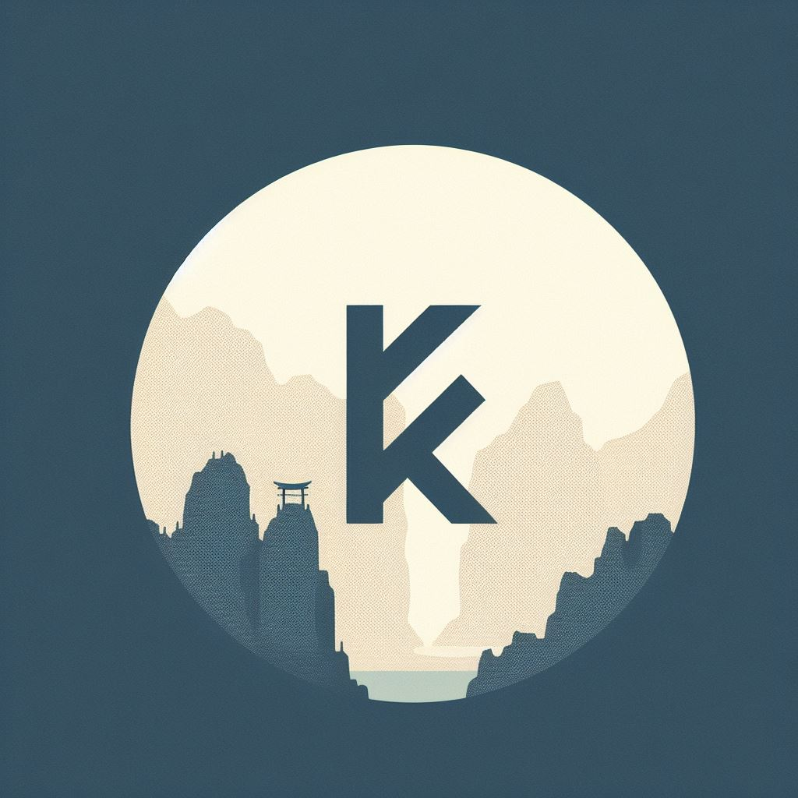
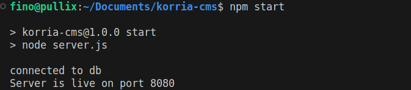

<p align="center">
  <a href="" rel="noopener">
 </a>
</p>

<h3 align="center">Korria Headless CMS</h3>

<div align="center">

[](/LICENSE)

</div>

---

<p align="center"> Korria is a minimalistic implementation of a headless CMS API.
    <br>
</p>

## 📝 Table of Contents

- [About](#about)
- [Getting Started](#getting_started)
- [Installation](#installing)
- [Deployment](#deployment)
- [Usage](#usage)
- [Built Using](#built_using)
- [Authors](#authors)
- [Acknowledgments](#acknowledgement)

## 🧐 About <a name = "about"></a>

This project was carried out as part of the ALX SE webstack portfolio project (Backend Specialisation track).

---
## :exclamation: ```NOTE TO ALX REVIEWER```
> This Project is an initial test implementation of the **Headless CMS**. While the functionality discussed in this document works as expected, There were some noticeable pain points during development that kept the API implementation at a minimal state. That being said, i found it necessary to begin the project on a new slate. Please see attached github repo below to view the progress of **Korria Version 2**

###### [Korria-CMS Version 2 Repo](https://github.com/AtangfMokamogo/korria-cms-2.0)

---

## 🏁 Getting Started <a name = "getting_started"></a>

These instructions will get you a copy of the project up and running on your local machine for development and testing purposes. See [deployment](#deployment) for notes on how to deploy the project on a live system.

---

### Prerequisites

- This project was developed in NodeJS and use Javascript (ES6). Familiarity with **npm** and running node apps is Expected

- To start clone this repository..

  ```sh
  git clone https://github.com/AtangfMokamogo/korria-cms.git
  ```

- then proceed to [Installation](#installing)

---

## 🏁 Installation <a name = "installing"></a>


- `cd` into the cloned directory.

- run the installation script

```sh
   ./installer.sh
```

- After all packages have been installed. run the server with

```sh
npm start
```

You should receive a confirmation if server has started succesfully

 </a>

## 🎈 Usage <a name="usage"></a>

:exclamation:
> Korria Headless CMS does not implement a front end dashboard for managing the content. The scope of developing viable front end application is beyond my knowledge that being said however, the code is laid out in a simple and straight forward manner, allowing anyone experienced in front end technologies to develop a dashboard with their chosen tools.

**To Use Korria familiarity with REST API CLIENTS like Postman is beneficial but not really a requirement**

Users who are unfamiliar with Postman can access the interactive swagger-ui docs page using:

```javascript
http:localhost:8080/api-docs
```

## 🚀 Deployment <a name = "deployment"></a>

Korria CMS is a node app that runs an Express Js server and can be deployed to Hosting Agents that support NodeJS apps. Below is an example of how you can deploy Korria to an NGINX web server

---
#### Deploying an Korria-CMS App with NGINX

## Prerequisites

Before you start, make sure you have the following:

- [Korria CMS Code](https://github.com/AtangfMokamogo/korria-cms)
- A server with NGINX installed
- Node.js and npm installed on your server **(if you followed the Install instructions in this page you should have the packages installed already)**

##### Step 1: Install Your Korria-CMS Application

First, you need to install your Korria-CMS application on your server. You can do this by cloning your application from your Git repository, or by uploading your application files directly to your server.

```sh
git clone https://github.com/AtangfMokamogo/korria-cms.git
cd korria-cms
npm i -y
```

##### Step 2: Start Your Korria-CMS Application

You can start your Korria-CMS application with the `npm start` command. However, for a production environment, you should use a process manager like PM2 to keep your application running even after the server restarts.

```sh
npm install pm2 -g
pm2 start app.js
```

##### Step 3: Configure NGINX

Next, you need to configure NGINX to proxy requests to your Korria-CMS application. Open the default NGINX configuration file in a text editor:

```sh
sudo nano /etc/nginx/sites-available/default
```

And add the following configuration:

```nginx
server {
    listen 80;

    location / {
        proxy_pass http://localhost:3000; # replace with the port your app runs on
        proxy_http_version 1.1;
        proxy_set_header Upgrade $http_upgrade;
        proxy_set_header Connection 'upgrade';
        proxy_set_header Host $host;
        proxy_cache_bypass $http_upgrade;
    }
}
```

Save and close the file when you're finished.

##### Step 4: Restart NGINX

Finally, restart NGINX to apply the changes:

```sh
sudo service nginx restart
```

Now, you should be able to access your Korria-CMS instance at your server's IP address or domain name.

---

Once Korria is deployed head to ```http://localhost/korria-docs/``` you will get a live interaction with the API. The documentation is intuitive, the endpoints are arranged in a logical flow of how a user will likely interact with the application.

> If you have any challenges navigating the API or setting up a project, I invite you to watch the demo video of the application here: [Korria CMS Demo](https://youtu.be/4J-Q-rqtjT0)


## ⛏️ Built Using <a name = "built_using"></a>

- [MongoDB](https://www.mongodb.com/) - Database
- [Express](https://expressjs.com/) - Server Framework
- [NodeJs](https://nodejs.org/en/) - Server Environment
- [Swagger-UI](https://swagger.io/tools/swagger-ui/)

## ✍️ Authors <a name = "authors"></a>

- [Atang Fino Mokamogo](https://github.com/atangfmokamogo) - Idea & Initial work

See also the list of [contributors](https://github.com/atangfmokamogo/korria-cms/contributors) who participated in this project.

## 🎉 Acknowledgements <a name = "acknowledgement"></a>

* **Project Inspiration**
Korria CMS attempts to implement a headless cms with the minimal most features. This simplicity is inspired by [DatoCMS](https://www.datocms.com/) and the project implements (in code) a similar user workflow.


     **A BIG SHOUT OUT TO ALX STUDENT COMMUNITY**
* A big thank you to ALX Student communities for insight as to how to improve the project going forward, the current work on [Korria-CMS-2.0](https://github.com/AtangfMokamogo/korria-cms-2.0) could have not been possible without this!!
